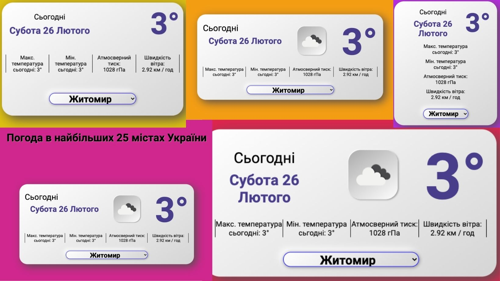

#Weather Api v1.0.2

Language: UA

Tehnologies: Html, Clean Css, Java Script

Api: <code>[Open Weather Map](https://info.tomorrow.io/weather-api-ad?utm_adgroup=weatherbit_io&utm_source=google&utm_medium=cpc&utm_campaign=TMO_-_API_-_Competitor_-_Misc_-_US_+_T2&utm_term=openweather%20map&utm_content=575632402747&hsa_acc=4679135646&hsa_kw=openweather%20map&hsa_net=adwords&hsa_cam=12575195996&hsa_ad=575632402747&hsa_grp=131023511943&hsa_src=g&hsa_mt=p&hsa_tgt=kwd-916920581442&hsa_ver=3&gclid=CjwKCAiAvOeQBhBkEiwAxutUVJQcR2L9wLgoXceF9PEdTHIIIPp8coVi-HZ08nZOmEobCE7pYzlvwRoC7wYQAvD_BwE)</code>

